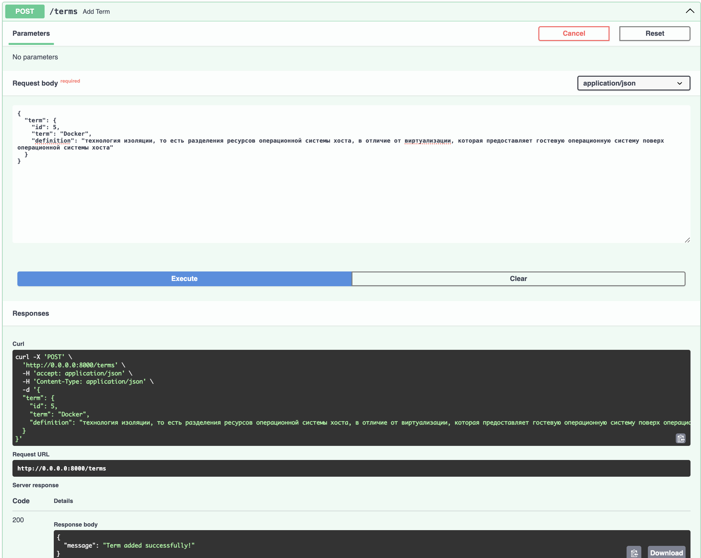
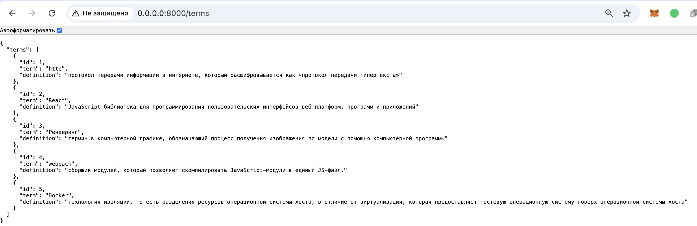
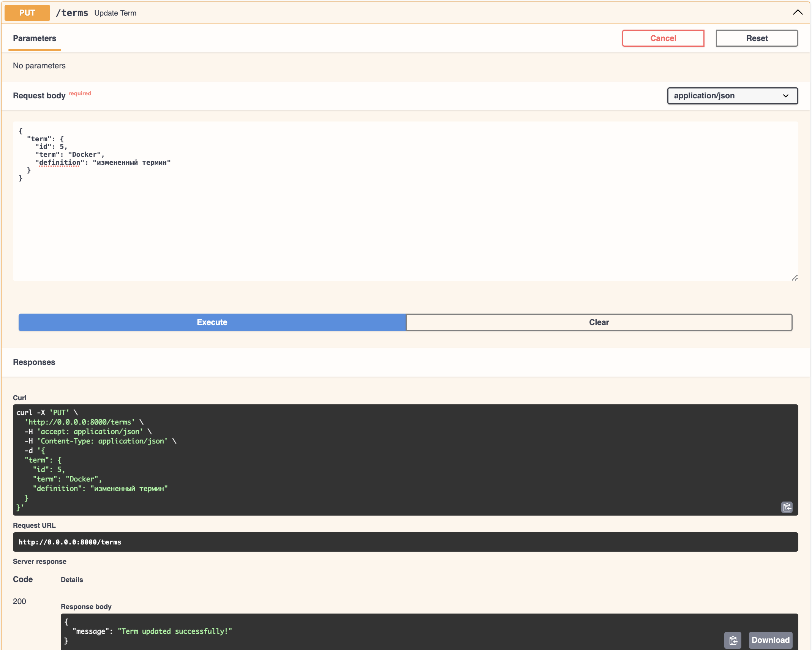
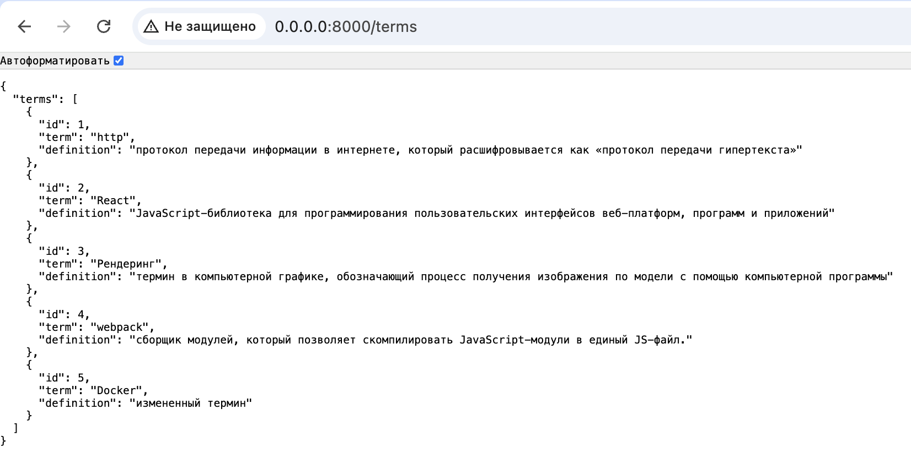
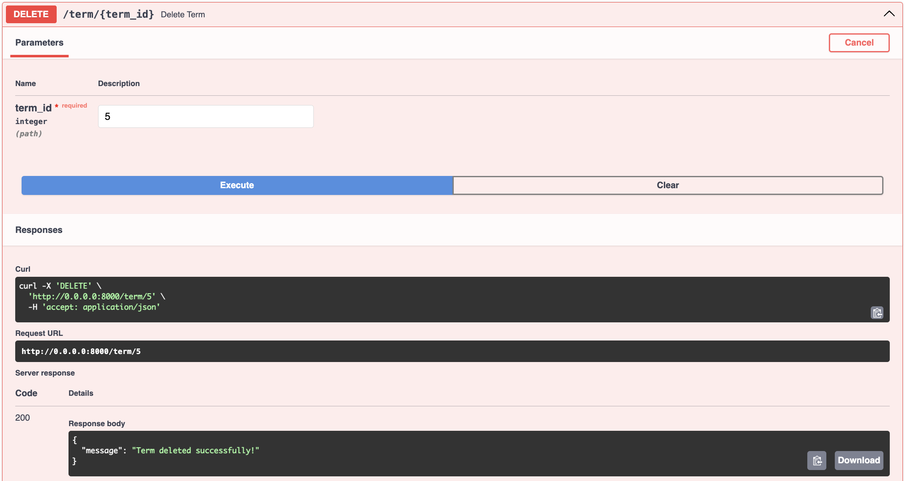
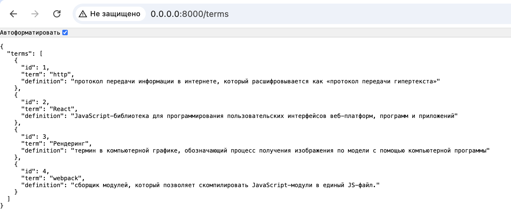

# RPC. gRPC. Protobuf

## Задание

Реализуйте задание практики, опубликованное по ссылке, с использованием gRPC, protobuf, предоставьте ссылку на репозиторий GitHub со всеми необходимыми компонентами для развертывания. При возможности, разверните словарь на публичном сервере в вебе.

В репозитории отразите отчет с помощью файла с разметкой Markdown, где демонстрировался бы процесс развертывания и работы сервиса.

## Выполнение задания

### Развертывание

1. Клонируйте репозиторий

```
git clone ..
cd practice-7
```

2. Установите зависимости

```
pip install -r requirements.txt
```

3. Сгенерируйте файлы proto

```
python -m grpc_tools.protoc -I. --python_out=. --grpc_python_out=. glossary.proto
```

4. Соберите и запустите контейнер

```
docker-compose up --build
```

5. API будет доступно по адресу `http://0.0.0.0:8000`

### Используемые библиотеки

- FastAPI: Основной фреймворк для создания REST API, предоставляющий простую настройку маршрутов и автоматическую генерацию OpenAPI-документации.
- Grpcio: Библиотека для реализации gRPC-сервисов и клиентов на Python. Она предоставляет средства для создания эффективных и масштабируемых двусторонних RPC-соединений, поддерживающих синхронные и асинхронные вызовы, а также поддержку различных форматов передачи данных, таких как Protocol Buffers.
- Grpcio-tools: Инструмент для генерации Python-кода из .proto файлов, описывающих сервисы и сообщения в gRPC. Он используется для автоматического создания классов, которые упрощают работу с сериализацией данных и вызовами gRPC-сервисов.
- Uvicorn: Легковесный ASGI-сервер для запуска приложения.
- SQLite: Легковесная база данных для хранения терминов.
- SQLAlchemy: ORM для работы с базой данных, что упрощает выполнение CRUD-операций.

### Примеры работы

#### Вывод всех терминов

Выводятся три термина из initial_terms и один ранее добавленный

```
initial_terms = [
    {"term": "http", "definition": "протокол передачи информации в интернете, который расшифровывается как «протокол передачи гипертекста»"},
    {"term": "React", "definition": "JavaScript-библиотека для программирования пользовательских интерфейсов веб-платформ, программ и приложений"},
    {"term": "Рендеринг", "definition": "термин в компьютерной графике, обозначающий процесс получения изображения по модели с помощью компьютерной программы"},
]
```


#### Добавление нового термина

Добавим термин Docker



#### Получение одного термина


#### Измение термина

Изменим термин Docker



#### Удаление термина

Удалим термин Docker


